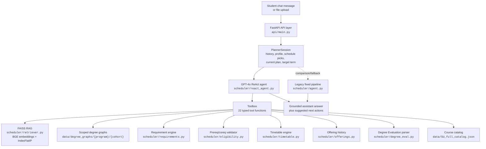
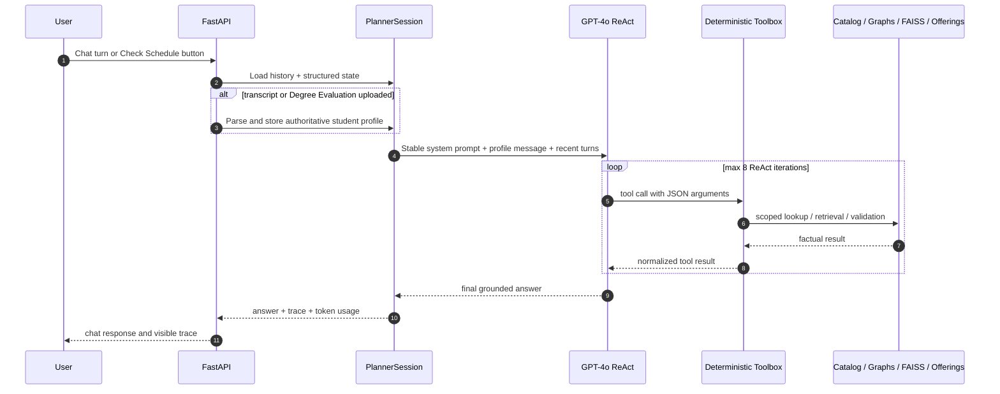
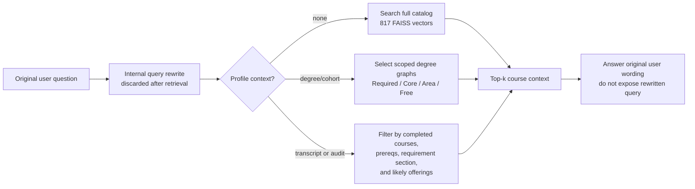

# SuSchedule-r

**A Retrieval-Augmented, Tool-Using Course Scheduler-Assistant for Sabanci University**

SuSchedule-r is the CS 455 / CS 555 Large Language Models final project by Kerem Sirtikizil, Cagan Cakir, and Eray Cagan Ozdemir. It is a working course-advising chatbot and schedule checker grounded in Sabanci catalogue data, prerequisite graphs, degree/cohort requirements, course offering history, and a student's uploaded academic context.

The important design decision is simple:

> The LLM explains and orchestrates. Deterministic tools own the facts.

The runtime is primarily a **single GPT-4o ReAct tool-calling agent**, not a multi-agent system. The agent can search the catalog, select scoped degree graphs, inspect requirements, check prerequisites, validate plans, and test schedules, but the hard constraints are computed by Python code.

---

## Table of Contents

1. [Submission Status](#1-submission-status)
2. [What the System Does](#2-what-the-system-does)
3. [Architecture](#3-architecture)
4. [Repository Layout](#4-repository-layout)
5. [Setup](#5-setup)
6. [Run the App](#6-run-the-app)
7. [Debug CLI](#7-debug-cli)
8. [Data Pipeline](#8-data-pipeline)
9. [RAG and FAISS](#9-rag-and-faiss)
10. [Runtime Modules](#10-runtime-modules)
11. [Evaluation and Tests](#11-evaluation-and-tests)
12. [Human-Labeled Datasets](#12-human-labeled-datasets)
13. [Known Limitations](#13-known-limitations)
14. [Optional Cleanup](#14-optional-cleanup)
15. [Use of LLM Assistants](#15-use-of-llm-assistants)

---

## 1. Submission Status

The project is ready for a CS 455 application/system-building submission:

- working FastAPI web app,
- working ReAct course-advising chatbot,
- deterministic prerequisite/requirement/schedule engines,
- FAISS-backed RAG over the Sabanci catalogue,
- versioned FAISS artifacts for deterministic demos,
- debug CLI that prints tool calls and tool results,
- reproducible evaluation suite,
- final report in `report/`,
- honest error analysis and limitations.

Current branch during this audit: `eval-1`.

One local code file, `scheduler/react_agent.py`, already had uncommitted changes before this documentation pass. Those changes were preserved and not edited here.

---

## 2. What the System Does

The assistant supports three levels of advice.

| Level | User can do this without profile? | Uses RAG? | Uses degree graph? | Uses transcript / Degree Evaluation? |
|---|:---:|:---:|:---:|:---:|
| Exploratory catalog chat | yes | yes | optional | no |
| Degree-aware advising | degree/cohort needed | yes | yes | optional |
| Validated planning/scheduling | profile needed | yes | yes | yes |

Example user requests:

- "What does CS 412 cover?"
- "Suggest theoretical CS electives."
- "I am a CS student interested in networking and security. Which Core/Area electives fit?"
- "What requirements do I still need for graduation?"
- "Can CS 412 and CS 302 fit in my current schedule?"
- "Plan next semester, but only after checking prerequisites and likely offerings."

The assistant should answer ordinary course questions directly, then offer next actions. It should not silently create a full semester plan unless the user asks for one.

---

## 3. Architecture

The diagrams in this section are Mermaid diagrams, so GitHub renders them as structured architecture figures while keeping the source readable in Markdown.

### High-Level Topology



### ReAct Turn Flow



### Retrieval and Planning Scope



### ReAct Mode

The main mode is `react`. GPT-4o receives a system prompt, structured student context, recent history, and tool definitions. It can call tools iteratively and then answer.

Important runtime constraints:

- max ReAct iterations per turn: **8**,
- history is capped by turn count,
- structured student state is kept outside message history,
- transcript/Degree Evaluation context is authoritative,
- `set_plan()` is guarded by deterministic validation,
- schedule conflict checks include direct labs/recitations/corequisites.

### Agent Tool Contract

The ReAct agent has one toolbox, but the tools are deliberately separated by responsibility. This is the contract the model is expected to follow:

| Tool | What it does | When the agent should use it |
|---|---|---|
| `get_student_profile` | returns the current structured profile: program, cohort, completed/in-progress courses, loaded Degree Evaluation/transcript state, schedule picks, and requirement summary | whenever the model needs to know whether profile context already exists |
| `set_student_context` | stores manually provided program, admit term, completed courses, or in-progress courses | only when the user explicitly gives academic context in chat |
| `select_degree_graphs` | selects scoped graphs from `data/degree_graphs/{program}/{cohort}/` and returns graph metadata | before degree/cohort-specific requirement or elective reasoning |
| `get_requirement_state` | computes remaining required/core/area/free requirements from selected graphs and official profile data | for graduation-progress and "what do I still need" questions |
| `get_degree_section_courses` | returns courses inside a selected requirement section, optionally RAG-ranked by a topic query | when the user asks about Required/Core/Area/Free Elective subsets |
| `get_current_plan` | returns the currently committed plan, if any | when discussing or modifying an already accepted plan |
| `rewrite_retrieval_queries` | rewrites the latest user message into short internal retrieval queries | before RAG on course-content, focus-area, and recommendation questions |
| `retrieve_catalog_courses` | searches catalog descriptions with FAISS and optional filters by degree, section, subject, or eligibility | for exploratory course questions and topic-based recommendations |
| `get_course_details` | exact catalog lookup for course codes, credits, prerequisites, corequisites, and descriptions | for questions naming specific course codes |
| `get_eligible_courses` | filters scoped graph courses by completed/in-progress courses and prerequisite expressions | for exact takeability after profile context exists |
| `check_prereqs` | returns prerequisite/corequisite text and eligibility verdict for one course | when the user asks whether they can take a course |
| `get_offering_pattern` | summarizes historical offering seasons and likely availability | when recommending for a future term or explaining offering uncertainty |
| `validate_plan` | checks a candidate plan for prerequisites, duplicates, already-taken courses, and credit bounds | only after the user asks for planning or gives courses to validate |
| `validate_courses` | checks a list of courses individually without committing a plan | when the user asks "can I take these?" |
| `set_plan` | commits a plan into session state | only after explicit user permission and successful `validate_plan` |
| `list_minors` | lists available undergraduate minors | for minor discovery questions |
| `get_minor_requirements` | returns minor rules and student progress when profile data exists | for "how close am I to a minor?" questions |
| `get_science_engineering_progress` | computes Engineering and Basic-Science ECTS progress | for engineering-degree graduation-credit questions |
| `find_courses_by_credit_type` | lists courses that actually carry Engineering or Basic-Science ECTS | when the user asks for courses with those credit types |
| `build_timetable` | builds a conflict-free schedule from real sections and auto-added direct recitations/labs | for "do these courses conflict?" or "build/show schedule" questions |
| `get_current_schedule` | reads the UI schedule-builder state, including selected recitations/labs and conflicts | when the user asks to check "my current schedule" |
| `check_courses_against_current_schedule` | tests candidate courses against the fixed current UI schedule | when the user asks whether suggested courses can be added |

This is why the system is not "the LLM remembers course facts." The model decides which tool to call, but the tool result is the source of truth.

### Pipeline Mode

The older `pipeline` mode remains as a comparison/fallback path. It follows a fixed 8-stage planner:

1. parse/load student profile,
2. compute remaining requirements,
3. build eligible/offered candidate pool,
4. retrieve relevant courses,
5. ask GPT-4o for a structured plan,
6. validate the plan,
7. repair violations,
8. resolve timetable when section data exists.

---

## 4. Repository Layout

```text
SuSchedule-r/
├── api/
│   ├── main.py                 # FastAPI endpoints and session store
│   └── static/                 # browser UI: HTML, CSS, JS, logo
│
├── scheduler/
│   ├── react_agent.py          # GPT-4o ReAct loop and 22-tool Toolbox
│   ├── session.py              # stateful chat/session orchestration
│   ├── llm_client.py           # OpenAI wrapper, tool calls, token usage
│   ├── retriever.py            # FAISS + BGE RAG retriever
│   ├── requirements.py         # remaining degree requirements
│   ├── graph_selector.py       # program/cohort graph selection
│   ├── degree_eval.py          # official Degree Evaluation HTML parser
│   ├── transcript.py           # academic-records PDF/JSON parser
│   ├── eligibility.py          # prerequisite/corequisite/credit validation
│   ├── timetable.py            # section meeting parser and conflict search
│   ├── offerings.py            # historical offering pattern helpers
│   ├── catalog.py              # catalog lookup and lexical helpers
│   ├── eng_sci.py              # Engineering / Basic-Science ECTS logic
│   ├── minors.py               # minor requirements/progress helpers
│   ├── schemas.py              # request/plan dataclasses and schemas
│   ├── prompts.py              # system/user prompt templates
│   ├── agent.py                # legacy fixed planner pipeline
│   ├── intents.py              # legacy intent routing helpers
│   └── cli.py                  # interactive/debug CLI
│
├── scraper/
│   ├── discover.py             # discover courses from degree/pool pages
│   ├── scrape_full.py          # scrape full catalog metadata
│   ├── scrape_cs.py            # lower-level Banner scraping helpers
│   ├── prereq_parser.py        # prerequisite text -> boolean expression tree
│   ├── build_graph.py          # unified prerequisite DAG
│   ├── build_degree_graphs.py  # per-program/per-cohort/per-section graphs
│   ├── scrape_offerings.py     # section/CRN/meeting scraper
│   ├── build_eng_sci.py        # Engineering/Basic-Science credit table
│   ├── build_minors.py         # minor requirement tables
│   └── audit_prereqs.py        # parser coverage diagnostics
│
├── data/
│   ├── SU_full_catalog.json    # 817 structured courses
│   ├── SU_full_graph.*         # full prerequisite graph
│   ├── degree_graphs/          # {program}/{cohort}/{section}.{json,gpickle}
│   ├── offerings*.json         # term offerings and meeting times
│   ├── eng_sci_credits.json    # Basic-Science / Engineering ECTS credits
│   ├── minors.json             # minor requirement data
│   └── transcript_cagan.json   # sample parsed student context
│
├── embeddings/
│   ├── su_courses.parquet
│   ├── id_map.json
│   ├── su_courses_embeddings.npy
│   └── su_courses.index        # FAISS IndexFlatIP, committed for demos
│
├── eval/
│   ├── retrieval_queries.json  # human-labeled RAG benchmark
│   ├── agent_questions.json    # human-labeled end-to-end benchmark
│   ├── general_conversation_questions.json
│   │                           # human-labeled transcript-free chat benchmark
│   ├── submission_human_cases.json
│   │                           # 20-case report coverage matrix
│   ├── run_retrieval.py
│   ├── run_conflicts.py
│   ├── run_requirements.py
│   ├── run_agent.py
│   ├── results_*.json
│   └── agent_transcript.md
│
├── report/
│   ├── CS455_SuSchedule-r_Report.md
│   ├── CS455_SuSchedule-r_Report.pdf
│   ├── CS455_SuSchedule-r_Slides.pptx
│   └── DEMO_SCRIPT.md
│
├── courses/ degrees/ pools/ offerings/
│   └── cached HTML from Banner/SU pages
│
├── requirements.txt
├── .env.example
└── README.md
```

---

## 5. Setup

### 5.1 Clone and Create the Environment

```bash
git clone https://github.com/keremsirtikizil/SuSchedule-r.git
cd SuSchedule-r

# Use the submitted branch if it is not already the default branch.
git switch eval-1

python3 -m venv .venv
source .venv/bin/activate
pip install -r requirements.txt
```

Python 3.10+ is expected. The project has been tested locally with Python 3.12.

### 5.2 Add the API Key

```bash
cp .env.example .env
```

Then edit `.env`:

```text
OPENAI_API_KEY=your_key_here
```

Do not commit `.env`. It is ignored by git.

### 5.3 Reproducibility Notes

The repository includes the built data artifacts needed for a deterministic demo:

- `data/SU_full_catalog.json`
- `data/degree_graphs/`
- `data/offerings*.json`
- `data/eng_sci_credits.json`
- `data/minors.json`
- `embeddings/su_courses.index`
- `embeddings/su_courses_embeddings.npy`
- `embeddings/su_courses.parquet`
- `embeddings/id_map.json`

Reviewers do **not** need to rerun the scraper pipeline or rebuild FAISS before testing the submitted system.

Without an OpenAI API key, these local checks still run:

```bash
python -m eval.run_retrieval
python -m eval.run_conflicts
python -m eval.run_requirements
python -m scheduler.retriever
python -m scraper.audit_prereqs
```

With an OpenAI API key, these live agent checks also run:

```bash
python -m eval.run_agent
python -m eval.run_agent --dataset general_conversation_questions.json
```

If the submitted branch is already checked out by the instructor, start from `python3 -m venv .venv`; the `git clone` / `git switch` lines are only for a fresh local checkout.

### 5.4 Dependency Roles

| Dependency area | Used for |
|---|---|
| FastAPI / uvicorn | web backend |
| pandas / numpy / pyarrow | catalog and embedding metadata |
| faiss-cpu | vector search over course embeddings |
| sentence-transformers | BGE bi-encoder and cross-encoder |
| networkx | prerequisite and degree graphs |
| beautifulsoup4 / requests | scraping Banner/SU pages |
| pdfplumber | transcript PDF parsing |
| openai | GPT-4o ReAct and structured calls |
| python-dotenv | `.env` API key loading |

---

## 6. Run the App

```bash
source .venv/bin/activate
uvicorn api.main:app --reload --port 8000
```

Open:

```text
http://127.0.0.1:8000/
```

The web app supports:

- creating a chat session without a transcript,
- asking catalog questions with RAG,
- uploading a transcript PDF/JSON or Degree Evaluation HTML,
- asking degree-specific questions,
- adding courses to the schedule builder,
- checking current schedule conflicts,
- viewing tool traces in the UI.

### REST Endpoints

| Method | Endpoint | Purpose |
|---|---|---|
| `GET` | `/` | serve SPA |
| `POST` | `/session` | create a session |
| `POST` | `/session/{id}/transcript` | upload transcript/Degree Evaluation |
| `POST` | `/session/{id}/turn` | send chat message |
| `GET` | `/session/{id}/state` | inspect session state |
| `GET` | `/session/{id}/course_sections` | fetch sections for a course |
| `POST` | `/session/{id}/schedule` | update UI schedule picks |
| `POST` | `/session/{id}/check_schedule` | ask agent to review current schedule |
| `DELETE` | `/session/{id}` | clean session |

---

## 7. Debug CLI

For demos, the CLI can print every agent step, tool call, arguments, tool result, and final answer.

```bash
source .venv/bin/activate
python -m scheduler.cli \
  --transcript data/transcript_cagan.json \
  --term 202601 \
  --mode react \
  --debug-trace
```

Useful one-shot demo:

```bash
python -m scheduler.cli \
  --transcript data/transcript_cagan.json \
  --term 202601 \
  --mode react \
  --debug-trace \
  --one-shot \
  --first-message "Suggest CS Core Electives about security and networking, and check likely offerings."
```

CLI commands:

| Command | Purpose |
|---|---|
| `/trace` | pretty-print last trace |
| `/raw-trace` | print full trace JSON |
| `/state` | inspect session state |
| `/json` | show current plan JSON |
| `/usage` | token usage and rough cost |
| `/help` | command list |
| `/exit` | quit |

---

## 8. Data Pipeline

The committed data is already built. Re-run only if Sabanci pages change.

```bash
source .venv/bin/activate

# Discover courses from degree pages / pools
python -m scraper.discover --degrees

# Optional broader discovery over subject-number ranges
python -m scraper.discover --subjects

# Scrape full course details
python -m scraper.scrape_full

# Build full prerequisite graph
python -m scraper.build_graph --full

# Build per-degree/per-cohort/per-section graphs
python -m scraper.build_degree_graphs

# Scrape offerings and meeting times
python -m scraper.scrape_offerings

# Build science/engineering and minor requirement data
python -m scraper.build_eng_sci
python -m scraper.build_minors

# Audit prerequisite parser coverage
python -m scraper.audit_prereqs
```

Outputs are cached and mostly idempotent.

Important generated files:

| File/dir | Meaning |
|---|---|
| `data/SU_full_catalog.json` | structured 817-course catalog |
| `data/SU_full_graph.gpickle` | full prerequisite graph |
| `data/degree_graphs/{program}/{cohort}/` | scoped degree requirement graphs |
| `data/offerings*.json` | offerings and meeting times |
| `data/eng_sci_credits.json` | engineering/basic-science ECTS mapping |
| `data/minors.json` | undergraduate minor rules |

---

## 9. RAG and FAISS

The RAG artifacts are committed for deterministic demos:

```text
embeddings/su_courses.parquet
embeddings/id_map.json
embeddings/su_courses_embeddings.npy
embeddings/su_courses.index
```

Index details:

- model: `BAAI/bge-base-en-v1.5`,
- dimension: 768,
- rows/vectors: 817,
- FAISS index type: `IndexFlatIP`,
- vectors are L2-normalized, so inner product is cosine similarity.

At query time:

1. the model rewrites the user's latest message into retrieval queries when helpful,
2. the query is embedded,
3. FAISS searches the full catalog or a filtered candidate set,
4. filters can restrict by degree graph, section, subject, season, or eligible courses,
5. optional cross-encoder re-ranking reorders candidates,
6. the assistant answers the original user message using retrieved context.

FAISS is mandatory. There is no NumPy vector-search fallback. If the FAISS index is missing or inconsistent, retrieval fails loudly.

Rebuild command:

```bash
python -m scheduler.build_faiss_index
```

If using Colab, `notebooks/build_faiss_index.ipynb` builds the same four artifacts.

---

## 10. Runtime Modules

| Module | Duty |
|---|---|
| `scheduler/react_agent.py` | primary ReAct agent, tool schema, toolbox, prefetching, trace events, guardrails |
| `scheduler/session.py` | stores conversation state, student context, current plan, current schedule, history |
| `scheduler/retriever.py` | FAISS-backed RAG retrieval and optional cross-encoder re-ranking |
| `scheduler/graph_selector.py` | maps program/admit term to correct cohort graph directory |
| `scheduler/requirements.py` | computes remaining requirements from selected degree graphs |
| `scheduler/degree_eval.py` | parses official Banner Degree Evaluation HTML |
| `scheduler/transcript.py` | parses academic-records PDF/JSON into student context |
| `scheduler/eligibility.py` | evaluates prereq/coreq expression trees and validates plans |
| `scheduler/timetable.py` | normalizes meetings, checks overlaps, builds conflict-free section combinations |
| `scheduler/offerings.py` | estimates likely offering patterns from historical terms |
| `scheduler/catalog.py` | exact course lookup and lightweight lexical helpers |
| `scheduler/eng_sci.py` | engineering/basic-science credit progress |
| `scheduler/minors.py` | minor catalog and minor progress |
| `scheduler/llm_client.py` | OpenAI calls, tool calling, structured output, usage accounting |
| `scheduler/cli.py` | terminal demo and trace inspection |
| `api/main.py` | FastAPI endpoints and session lifecycle |

---

## 11. Evaluation and Tests

Run from the repo root with the virtual environment active.

### 11.1 Retrieval Evaluation

```bash
python -m eval.run_retrieval
```

Measures:

- Hit@1, Hit@5,
- Recall@5, Recall@10,
- MRR@10,
- nDCG@10,
- cross-encoder ON vs OFF ablation,
- FAISS backend evidence.

Current saved headline from the latest completed run:

| Metric | Re-ranker ON | Re-ranker OFF |
|---|---:|---:|
| Hit@5 | 0.955 | **0.977** |
| Recall@10 | 0.943 | **0.966** |
| MRR@10 | 0.859 | **0.938** |

Backend evidence:

```text
IndexFlatIP · 817 vectors · FAISS searches=88
```

Interpretation: FAISS RAG is strong; the cross-encoder re-ranker hurts this short-query benchmark, so this is reported as a negative ablation result.

### 11.2 Conflict and Timetable Evaluation

```bash
python -m eval.run_conflicts
```

Measures:

- interval-overlap correctness on 12 human-labeled meeting pairs,
- feasible/infeasible timetable classification on 6 real bundles,
- whether required labs/recitations are included,
- whether any returned schedule still has overlaps.

Current headline:

```text
labeled-pair accuracy = 1.000
precision = 1.000
recall = 1.000
unsound schedules = 0
wrong feasibility results = 0
incomplete corequisite picks = 0
```

This is deterministic and does not call OpenAI.

### 11.3 Requirement Evaluation

```bash
python -m eval.run_requirements
```

Measures:

- official Banner Degree Evaluation totals,
- graph-engine Required bucket gap,
- discrepancy between official audit and graph engine.

Current headline:

```text
official total: 122 / 125 SU = 97.6%
official remaining: 3 SU
engine required credits left: 7 SU
required-bucket discrepancy: +4 SU
```

Interpretation: the graph engine is conservative but needs a course-equivalence/substitution table to exactly match Banner.

### 11.4 End-to-End Agent Evaluation

```bash
python -m eval.run_agent
```

Requires `OPENAI_API_KEY`.

Measures:

- answer grounding,
- required semantic actions,
- task success,
- tool calls,
- latency,
- token cost.

Current headline:

```text
questions = 12
answer grounding = 0.9167
action success = 1.0000
task success = 0.9167
existing-label task success = 11/11
provisional-label task success = 0/1
avg latency = 8.59 s
avg tokens = 6691
```

To re-score saved raw answers after changing labels without paying for another API run:

```bash
python -m eval.run_agent --rescore
```

General transcript-free conversation benchmark:

```bash
python -m eval.run_agent --dataset general_conversation_questions.json
```

This runs the same ReAct agent without a loaded transcript. It checks whether the assistant can answer ordinary catalog questions with RAG, carry short conversational context, avoid unnecessary planning actions, and ask for profile data only when exact planning requires it.

Note: `agent_questions.json` now contains an additional `a13` UI schedule-builder case, and `general_conversation_questions.json` contains a `g09` transcript-free Check Schedule case. Re-run the live agent evaluation before quoting final updated metrics.

### 11.5 Basic Syntax/Smoke Checks

```bash
python -m py_compile \
  scheduler/retriever.py \
  scheduler/react_agent.py \
  scheduler/session.py \
  scheduler/timetable.py \
  eval/run_retrieval.py \
  eval/run_conflicts.py \
  eval/run_requirements.py \
  eval/run_agent.py

python -m scheduler.retriever
python -m scraper.audit_prereqs
```

---

## 12. Human-Labeled Datasets

### Retrieval Dataset

File: `eval/retrieval_queries.json`

Current size: **44 queries**

Labels:

- `gold`: relevant course codes,
- `category`: topic bucket,
- `review_status`: `existing` or `provisional`.

Review split:

| Status | Count | Meaning |
|---|---:|---|
| `existing` | 34 | reviewed labels used as stable benchmark rows |
| `provisional` | 10 | exploratory additions needing more human review |

Examples:

| Query | Gold |
|---|---|
| "I want to learn machine learning" | `CS 412`, `CS 415` |
| "courses about neural networks and deep learning" | `CS 415`, `CS 412` |
| "how operating systems work internally" | `CS 307` |
| "designing and querying databases" | `CS 306` |

### Agent Dataset

File: `eval/agent_questions.json`

Current size: **13 questions**

Purpose: transcript-backed advising and factual correctness. The runner loads `data/transcript_cagan.json`, so the model should not re-ask for program, cohort, completed courses, or transcript when those facts are already available.

Labels can specify:

- required course codes,
- allowed/forbidden course codes,
- required/forbidden words or regexes,
- credit facts,
- required tool/action names,
- forbidden tool/action names,
- review status.

The evaluator records raw answers in `eval/agent_transcript.md`, so failures are inspectable.

Examples:

| Question type | Example label |
|---|---|
| single fact | `CS 412` must be linked to `3 SU` |
| prerequisite | `CS 301` answer must mention `CS 300` and `MATH 204` |
| catalog explanation | `CS 445` answer must mention NLP/natural language |
| timetable | `CS 412 + CS 302` must call `build_timetable` and mention conflict/no conflict-free result |
| recommendation | networking answer must call `retrieve_catalog_courses` and stay inside accepted catalog codes |
| UI schedule button | `a13` preloads schedule-builder picks and must call `get_current_schedule` |

### General Conversation Dataset

File: `eval/general_conversation_questions.json`

Current size: **9 questions**

Purpose: normal chat behavior without transcript upload. These are human-labeled examples of how the assistant should behave when a student asks exploratory questions such as "I want to learn networking" or "What does CS 412 cover?"

This dataset checks that the agent:

- uses FAISS RAG for open-ended course suggestions,
- uses exact lookup for specific course-code questions,
- does not invent a full plan during exploratory chat,
- does not call `set_plan` unless planning is explicitly possible and requested,
- asks for degree/cohort/transcript only when exact planning or takeability needs it,
- can still use timetable tools for direct conflict questions.

Examples:

| ID | Question | Key expected behavior |
|---|---|---|
| `g01` | networking course suggestions | call `retrieve_catalog_courses`, mention relevant networking/security/distributed-systems courses |
| `g02` | "What does CS 412 cover?" | call `get_course_details`, give a smooth content explanation |
| `g04` | IE optimization interest | retrieve IE/OR-related courses, avoid unrelated CS hallucinations |
| `g05` | "make this into a semester plan" | ask for missing profile context, do not call `set_plan` |
| `g08` | CS 412 + CS 302 conflict | call `build_timetable`, include recitation/lab conflicts |
| `g09` | transcript-free Check Schedule | call `get_current_schedule`, check conflicts/credits, avoid degree-progress claims |

### Submission Coverage Matrix

File: `eval/submission_human_cases.json`

Current size: **20 representative human-labeled cases**

Purpose: reviewer-facing coverage matrix used in the final report. It summarizes diverse behaviors across:

- catalog RAG,
- exact course facts,
- prerequisite/corequisite lookup,
- general exploratory chat,
- degree-scoped electives,
- transcript-backed requirements,
- permission-bound planning,
- timetable construction,
- current-schedule checking,
- candidate-vs-current-schedule checks,
- minor and Engineering/Basic-Science credit tools.

This file is not a separate paid live runner. It documents the human-labeled coverage design and points back to the runnable datasets and deterministic tests.

---

## 13. Known Limitations

1. **Course substitutions are incomplete.** The Degree Evaluation may accept substitutions such as `MATH 201 + MATH 202` for a requirement that the graph stores as `MATH 212`.
2. **Future scheduling uses proxy terms.** Until Fall 2026 offerings are published, the system uses the most recent same-season offering data.
3. **Cross-encoder re-ranking is not always beneficial.** It hurts the current short-query retrieval benchmark.
4. **Some grounding is not fully traceable.** Some correct answers use injected context without an explicit tool call in the visible trace.
5. **Tool-calling can be brittle.** The ReAct agent sometimes emits slightly malformed parameters, small section-name typos, or arguments meant for a neighboring tool. JSON schemas and normalization reduce this, but production would need stricter validators and recovery paths.
6. **Evaluation is still small.** Labels are human-created and useful, but not exhaustive. Provisional labels are separated for this reason.
7. **Sessions are in memory.** Restarting the server clears the session.

---

## 14. Optional Cleanup

These files are safe to remove from the GitHub repository before final submission because they are scratch or stale build artifacts, not runtime inputs:

```bash
git rm .ipynb_checkpoints/test-checkpoint.ipynb
git rm test.ipynb
git rm report/build_report.js
```

Do **not** remove these for the demo/submission unless you intentionally want to shrink the repository and update the docs accordingly:

| Keep | Why |
|---|---|
| `embeddings/` | required for deterministic FAISS RAG demos |
| `data/SU_full_catalog.json` | runtime catalog source |
| `data/degree_graphs/` | scoped degree/cohort requirement graphs |
| `data/offerings*.json` | schedule and offering-pattern data |
| `data/eng_sci_credits.json` | Engineering / Basic-Science credit checks |
| `data/minors.json` | minor advising tools |
| `eval/*.json` and `eval/run_*.py` | reproducible evaluation datasets and runners |
| `report/CS455_SuSchedule-r_Report.tex` | editable final report source |
| `report/CS455_SuSchedule-r_Report.pdf` | ready-to-submit report output |

The raw HTML caches under `courses/`, `degrees/`, `pools/`, and `offerings/` are not needed at runtime, but they are useful for scraper reproducibility and auditing. Keep them unless repository size becomes a problem.

## 15. Use of LLM Assistants

LLMs were used in two ways.

First, LLMs are runtime components of the system. GPT-4o powers the ReAct advising loop and planner behavior. GPT-4o/GPT-4o-mini can be used for intent classification and retrieval-query rewriting depending on configuration.

Second, coding assistants were used during development. The team designed the project structure, deterministic parser/graph architecture, evaluation plan, and iterative test cases. LLM coding assistants helped implement and refactor ReAct agent code, helper functions, UI code, evaluation runners, documentation, and trace tooling from our specifications. The team inspected, tested, corrected, and owns the final output.

No evaluation numbers in this README or report were invented by an LLM. They come from the scripts and JSON results under `eval/`.
